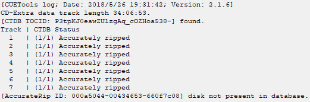

# 前言

　　下载地址：[CUETools](http://www.cuetools.net/install/CUETools_2.1.6.zip)。

　　这个软件是绿色软件，解压即可使用，你可以右键主程序“CUETools.exe”来创建快捷方式或是固定到开始菜单。

# 1. 检测原理

　　CUE Tools利用抓轨数据库的数据来对比音乐文件的方法来实现无损音乐的检测，是目前检测CD无损音乐比较好的方法。目前有2个免费的CD音乐抓轨数据库，存放世界各地的用户通过精确抓轨上传的音乐CD抓轨信息：

　　① AccurateRip数据库（以下简称ARDB）：通过EAC软件精确抓轨（AccurateRip）的音乐CD数据可以上传到这个[数据库](http://wiki.hydrogenaud.io/index.php?title=AccurateRip "AccurateRip")。它拥有两个版本，分别称为ARv1和ARv2。v1于2003年起就在发挥作用，其已经包含了超过200万张专辑的相关数据。由于v1的算法缺陷导致会跳过3%的音频数据不纳入计算，v2应运而生，相应地，v2的数据比之前者要少一些。此外，光驱偏移值也会纳入计算，其对于偏移值是“敏感的”。

　　② CTDB数据库：即CUE Tools数据库，EAC软件通过安装CUE Tools插件或者使用CUETools带的CUERipper软件抓取的音乐CD数据上传到这个数据库。该数据库启用于2011年，其对偏移值“不敏感”。它所存储的数据能够帮助你修复有错误的音频文件，但对于音轨前间隙、隐藏音轨则无能为力，因为它不存储这些数据。同时，它也能计算音频文件的CRC值与EAC生成的LOG文件中记录的CRC值相比较，以保证它们是对应的。

　　CUE Tools通过检测无损音乐文件产生相应的检测数据，并与数据库中的数据对比，来显示你的音乐文件是否与别人上传的抓轨数据是否匹配。

　　CUE Tools能用来作对比的数据库保存的是整张音乐CD的检测数据，所以它无法检测单首歌的音乐文件。

# 2. 设置开启检测报告自动生成

　　点击主界面右上角的按钮进入设置界面，进入【AccurateRip】选项卡。

　　

　　如图勾选设定即可。【Name format】是用来设置生成检测报告文件的命名方式的，像图中这样写，生成的报告就是一个固定的名称，而如果使用默认的“%filename%.accurip”，生成的就是与相应曲目同名的检测报告了。我更推荐固定命名方式，简单省事。

　　这样设置好后，在检测结束时会在文件夹内自动生成一个检测报告文件，扩展名为“.accurip”。

# 3. 通过拖放选择目录或文件

　　打开CUE Tools，然后按下面的步骤操作：

　　① 在导入模式中选择拖放模式：

　　

　　② 从资源管理器中直接将待检测专辑目录拖入：

　　

　　注意：这样拖入的目录中须直接含有音频文件。有时候一张专辑会包含多张CD，相应的文件夹里可能会含有子文件夹“Disc1”、“Disc2”，这时拖入专辑文件夹就会报错，你应拖入“Disc1”。

　　或是拖入CUE文件：

　　

　　注意：没有CUE文件就不能用这个方法。

　　再就是选中文件夹中全部的音频文件然后一起拖放：

　　

　　如果采用“%filename%.accurip”命名方式，这样拖放检测就会造成这样的结果：

　　

　　更糟糕的是，每个检测报告文件里的内容都是一模一样的。

　　以上三种拖放方式都是等效的。

# 4. 通过目录树选择目录或文件

　　如果你的音频资源都整理在一块儿，那么这也是个不错的选择。只需要更改导入模式，剩余部分大同小异。

　　

　　CUE文件最优先选择，因为CUE文件中可能包括DiscID信息，如果有，CUETools也会加以利用，通过对比通过音乐文件生成的DiscID与CUE文件中DiscID是否一致，如果不同会给出提示。另外如果CUETools数据库中有相应数据的话，会提醒你这一张是不是多媒体CD（包括图片、视频、文档的CD）并且会给出多媒体数据所占的时间范围（即Data track的时间）。

　　注：多媒体CD是指音频数据后面添加了图片、视频或文档等计算机文件的CD，包括音频部分（Audio track）和数据部分（Data track）。常见的是音频后面加专辑歌曲的MTV视频。抓轨时TOC中也会包括数据部分的起始和时长，数据的起始位与音频的最后一首歌一般会间隔一段空白，不是与音频相连的。在匹配ARDB和CTDB时必须提供数据部分的开始时间和时长，否则不能正确匹配对应的专辑，CUETools可以通过抓轨LOG中的TOC信息或者CUE文件中的DiscID来确定专辑是否有数据部分。

# 5. 检测与结果分析

　　

　　首先确保【Action】栏和【Mode】栏中选项如图勾选，然后点击【Go】按钮即可开始检测。

　　注：【Extra】栏中的【Pregap】是指前置空白，大部分的CD的第一首歌都是从00:00 开始的，即前面没有空白，但有些CD前面留了一些空白，起始位置不是00:00而是00:03、00:15之类，前置空白也会影响到能否匹配到对应的专辑。如一张有前置空白专辑被抓轨成了分轨，抓轨日志文件又丢失的话，用CUETools检测可能匹配不到正确的专辑，除非你知道前置空白并在【Pregap】一栏中输入。

　　注：图中的【Data track】是指数据时长，这个也会影响匹配，前面已有说明。【Pregap】和【Data track】一般可以忽略。

## 5.1. 有匹配记录

　　

　　上半部分是和CUETools数据库匹配的结果，表明这张CD共有3人抓轨，你手上的音频数据与其他15人的抓轨数据完全一致。

　　下半部分是和ARDB数据库匹配的结果，EAC开启AccurateRip之后数据都会上传到此。这个数据库的匹配数据有V1和V2两个版本，“0”表示与V1版本无匹配次数，“+”后的“2”表示与V2版本有2次匹配，“/”后的“2”表示V1、V2匹配次数之和，即表明你手上的音频数据与数据库中所有2人上传的抓轨数据相匹配。

## 5.2. 有匹配数据但偏移值有差

　　

　　CTDB有匹配而ARDB无匹配的原因在于抓轨者未在其EAC设定正确的光驱偏移值。下面的“Offsetted by 691”说明了这一点。

　　偏移值的设置是一项至关重要的设置，它能影响到能否无损抓轨，但是很多人忽略这一点，他们的LOG中该项数值为0，这导致他们的抓轨结果并不准确。差不多每个光驱都不能将读取头准确地定位在所要的扇区。对数据CD光盘来说这不是一个大问题，因为每个扇区都含有定位信息，所以驱动器可以很容易地找到正确的扇区。与之相反，音乐CD不含有扇区的位置信息，也就是说对音乐CD来说定位一个扇区是非常困难的。这就是驱动器在读取音乐CD时会产生偏移的原因。对多数现代光驱来说这个偏移是个定值，因此一旦你知道了这个值就可以纠正偏移产生的误差。该网站可以查到市面上绝大多数光驱的偏移值。

　　不同的光驱，偏移也可能会有不同，在读取偏移设置不正确的情况下，抓出来的文件也会有不同的，只有设置了正确的偏移，抓取出来的文件才会是相同且是正确的。偏移设置错误一般来说对听感影响不大，因为最大的偏移也远小于人类能够察觉的时长。正确设置偏移不需要理由，不设置偏移才需要（显然除了懒和无知以外也没有什么理由嗯）。

　　下面介绍纠正偏移后检测的方法：

　　在偏移正确的情况下无匹配，但在偏移691处V1无匹配，V2未检测。接下来手动设置偏移修正：

　　

　　在【Extra】一栏的【Offset】中填上检测结果中“Offsetted by”后面的数字，随后点击【Go】。

　　

　　这就说明，它虽不是最佳的抓轨结果，但可以确认是真无损。

## 5.3. 有帧边界提示

　　

　　首先请牢记一个结论：从CD抓取得来的音频数据文件以帧为最小单位（1帧（Frame）=24B），具体原理可以看[这里](http://www.soomal.com/doc/10100000331.htm)。

　　图中这句“Padded some input files to a frame boundary”大意是说“在帧边界填充了些额外的数据”，打个比方，德芙巧克力，很多人都吃过，它是有凹槽的，掰下来多是按着凹槽的痕迹来，一块一块，大致整齐，“在帧边界填充数据”就好比是没照着凹槽掰开，而是多了一半。出现这种状况的可能性较多，以下列举其中可能性最大的三个：

　　① 从有损音频文件转码而来的无损音频文件；

　　② 在网络上发行的正版数字专辑（注意，是正版数字专辑，而不是拥有版权却去其他音乐论坛盗档得来的资源）;

　　③ 使用错误的方式（如CUE Splitter这个软件，或是干脆看着频谱、波形图切）切割开的整轨音频文件；

## 5.4. 无匹配记录

　　

　　这个得考虑发行时间。

　　如果发行时间少于一两个月，没有数据是正常现象。

　　但是如果两个月以上仍旧没有数据，那这些音频文件是啥我就不知道了。

## 5.5. 其他可能的情况

### 5.5.1. CD-Extra data track length xx:xx:xx

　　

　　检测到了数据轨或正确地手动设置了数据轨的长度。

### 5.5.2. Pregap length xx:xx:xx

　　检测到了音轨前间隙或正确地手动设置了该间隙的长度。

### 5.5.3. CUETools DB: corrected xx errors

　　

　　使用了修复功能之后产生的记录。

### 5.5.4. HDCD: peak extend: xx, transient filter: xx, gain: xx

　　检测到 HDCD 编码（可禁用检测）。

### 5.5.5. Offset applied: xx

　　

　　在使用偏移值修复功能之后产生的记录。

### 5.5.6. Truncated 4608 extra samples in some input files

　　检测到并删除了文件末尾额外的4608个零样本（可禁用检测）。

### 5.5.7. Using preserved id, actual id is xxxxxxxx-xxxxxxxx-xxxxxxxx

　　CUE文件中保存的AccurateRip ID与实际通过计算所得的AccurateRip ID不一致。

### 5.5.8. CDDBId mismatch: xxxxxxxx vs xxxxxxxx

　　CUE文件中保存的Disc ID与实际通过计算所得的CDDB ID不一致。

# 6. 判断CD无损必须考虑的因素

　　实际要判断音乐是否无损远远没有上面说得那些简单，而是要根据检测得出的匹配次数结合不同专辑的各种因素综合考虑。

## 6.1. 专辑的销量

　　一张热门专辑的匹配次数如果比较低那就很值得怀疑了。比如，Taylor Swift的1989专辑销量有几百万张，而你的音乐专辑如果只有20+次匹配，那会让人觉得困惑，寻找另外的版本也许是更好的选择。

　　相反，一张冷门的专辑，如果有10多次的匹配次数，你就应该满足了。

## 6.2. 专辑的发行时间

　　一张刚发行不久的专辑，检测出的匹配次数肯定不多。相反，一张很早的专辑，检测次数肯定会多得多。

## 6.3. 专辑的类型

　　音乐CD也有不同的类型，如按曲目数量来分，可分为：单曲CD（Single CD）、EP（Extended Play，迷你专辑，只包含几首歌曲）、专辑CD（Album CD）等，单曲CD、EP这些CD的检测信息数据库不多，所以匹配次数不会很多。

　　CD按内容分可分为纯音乐CD和多媒体CD（包括图片、视频、文档的CD），对于多媒体CD而言，除非你的音乐专辑目录中包括抓轨LOG文件，而且这个LOG必须包括TOC信息（记录每首曲子的开始和长度信息），否则，不是没有匹配就是匹配次数很少。

## 6.4. 专辑的版本

　　同一艺人的同一专辑，可能会有普通版、豪华版等，很多时候，豪华版的匹配次数会比普通版多得多。

## 6.5. 专辑的语言

　　CTDB和ARDB这两个数据库中以英文专辑为主，因为英文唱片是产量最多和流传最广泛的。如果是中文专辑，即使销量很好，你也别指望匹配次数会很多。主要原因是国内很多原抓者抓轨时不设置精确抓轨，或者不将抓轨记录上传到数据库中去。

# 7. 通过检测结果判断专辑是否相同

　　如果你通过不同的渠道下载了同一艺人的同一专辑，并且曲目也相同，那怎么判断这两张专辑是否完全相同呢？

　　我们可以通过两个方法判定：

　　① CTDB的匹配次数：如果这两张专辑相同，那么CTDB的匹配次数肯定是相同的。ARDB匹配次数可能不同，因为ARDB的匹配是对偏移敏感的，如果两张专辑的偏移不同，则匹配次数不同，所以不能看ARDB的匹配次数。

　　② 不包括空白采样的CRC值：偏移会影响包括空白采样的CRC值，但一般不会影响不包括空白采样的CRC值。

　　如下图所示：

　　

　　左边是我在日本购买的RADWIMPS的《君の名は。》，右边是大陆引进版。

　　两张CD的CTDB匹配次数完全相同，毫无差别，但是ARDB的匹配结果却有很大不同。下面看一下CRC值。判断依据是左上角“--”所在行，这是整张专辑的CRC值，“CRC32”列是包含空白采样的CRC值，“W/O NULL”列则是不包含空白采样的CRC值，如果两张专辑不包含空白采样的CRC值相同，则可认为它们之间没有任何差别。事实证明引进版和原版是有细微差距的。

# 8. 修复有缺陷的专辑

## 8.1. 偏移值修复

　　对于同一张CD，笔者分别使用EAC和Foobar2000对其进行抓取，将所得结果使用CUETools进行检测，得到下图：

　　

　　左边，用EAC抓取的专辑在ARDB有匹配，而右边则显示在偏移值为48时才有匹配（“Offsetted by 48”），而48正是笔者所使用的光驱的偏移值：

　　

　　对于这样一张偏移值为0抓取到的专辑，CUETools的修复功能就有了用武之地。

　　首先将模式调整至如下图所示：

　　

　　即在【Action】一栏中点选“Encode”。右边的【Mode】一栏中三个选项分别为“内嵌CUE的整轨”、“外置CUE的整轨”、“分轨”。在【Audio Output】中选择如图输出配置，在【Output】一栏设置方便的输出路径，在【Template】一栏设置命名格式以一劳永逸，再将正确的偏移值输入【Offset】一栏，然后点击【Go】。随后弹出警告：

　　

　　意思是说填入不为零的偏移值会导致部分数据被抛弃，确认要继续吗，答案自然是肯定的。

　　

　　随后跳出标签选择窗口，即使是一堆“音轨 01”之类没有标签的文件你也能摆平。确认标签信息无误之后点击【Ok】继续，最后得到输出报告：

　　

　　左边仍是正确抓轨的检测报告，右边则是修复后的检测报告，可见两者的CRC完全相同，为保证万无一失，我们再查看一下曲目2的MD5值：

　　EAC抓轨　A0DC9BA163B31FB2AF882060C5A386FA

　　修复前　　A4477997036922A54AAE1E7615688B2C

　　修复后　　A0DC9BA163B31FB2AF882060C5A386FA

　　显而易见，完成修复后的音轨与正确抓轨所得的文件完全一致了，也就是说，即便是下载到有缺陷的专辑，我们一样可以用CUETools来进行修复。不过，这个修复仅对于已有一定数量样本的专辑有效，如果你手头上的是根本无法识别的专辑，那还是洗洗睡吧。

## 8.2. 数据修复

　　除了偏移值缺陷，音频文件的数据也有可能有谬误，这会在Log文件中明确告知：

　　

　　注意上图的最后一句话：如果你确定你的抓轨结果包含谬误，你可以使用CUETools来修复它。不过由于笔者很确定笔者自己的抓轨没有问题，因而不需要修复，如果你能确定你手上的资源有这样的问题，那么也一样可以使用修复工具来修正它们。下面举例说明操作方法：

　　

　　在日志窗口有一行“(1/6) Accurately ripped, or (4/6) differs in 3 samples @00:03:06”，说是在3分06秒处，该专辑的数据有三个采样和其他4个抓轨者的数据不同，与之相同的只有一个人，此时应选择修复，在【Action】一栏的下拉菜单中选择“repair”，随后点击【Go】。在直接过掉几个窗口之后，会要求你选择修复的目标版本：

　　

　　选择“Confidence 4”的版本，然后点击【Ok】。

　　

　　如此则完成了专辑数据的修复。

# 9. 常见问题解答

## 9.1. CUETools具体有那些功能？

### 9.1.1. 可以在无抓轨Log的情况下检测整轨或分轨的音乐文件是否是从正版CD抓轨的

　　CUETools主要用于检测从网络下载的无损音乐文件的来源是否正版CD，即是否是从正版CD抓轨下来的。在仅有音频文件的条件下它能通过检测来确定专辑是否来源于正版CD，也就是说不需要抓轨Log文件。

　　但有两点限制：

　　①CUETools只能检测CD品质的音频文件。

　　CUETools依赖的抓轨数据库目前只支持位深16位、频率44.1kHz 的CD音频。

　　对于采样精度非16位（如24位、32位），采样率非44.1kHz(如48khz、96khz、192khz)的超高品质文件目前是不支持的。

　　②只支持整张专辑的检测，不支持单首歌曲的检测。

　　CUETools需要确定检测的音乐文件对应数据库中哪张专辑，这个用来判断的依据是CD的TOC（Table of Content，即每首歌曲的起始时间和时长），整轨可以通过cue文件中的信息来生成TOC，分轨也可以通过计算每首歌的时长来得到。

　　如果你要检测的是某张专辑中的一首歌曲或多首歌曲而不是专辑中的全部歌曲，那么CUETools会匹配不到对应的专辑或匹配到了错误的专辑，所以检测的结果是没有任何用处的。

　　注：如果是只有一首歌曲的单曲CD，你需要生成一个CUE文件才能进行检测。

### 9.1.2. 可以检测音乐专辑文件是否相对可靠

　　在没有抓轨Log的情况下，如何确定你从网上下载的无损音乐专辑数据的准确性呢？

　　这个可以通过CUETools检测后得到AccurateRip匹配次数来确认，如果你检测到的专辑大多数歌曲有10次以上的匹配次数，而其中有一两首歌是0次匹配的话，说明抓轨者的设定有缺陷，导致部分抓轨数据不准确，抑或是不同地区发行的同一专辑。

### 9.1.3. 可以检测出抓轨LOG文件是否匹配当前音频文件

　　在有抓轨Log的情况下，通过检测生成每首歌曲及整张专辑的CRC值，就可以与Log文件的CRC值对比是否一致。有时可能会遇到检测的CRC值与Log的CRC值不一致的情况，可能Log是假的，或者有人修改了CUE文件中歌曲的时长，或者通过软件对音频文件进行了一些莫名其妙的修改。总之，这样修改过的音频文件是无法恢复到与CD相同的整轨的，也不会有任何AccurateRip匹配次数。

### 9.1.4. 可以将整轨转成分轨，或从分轨转成整轨

　　CUETools的转换功能是非常强大的，支持转换成各种无损或有损格式的分轨或整轨，支持的无损格式有FLAC、WV、APE、TTA、WAV、M4A、TAK等，支持的有损格式有M4A、WMA、MP3、OGG等。要知道所有这些格式都是内置的，不需要额外的操作。在转换时，当你选择了目标格式后，还能选择不同的压缩级别，只要鼠标拖一下，非常方便。

　　注：M4A格式可以是无损的（即ALAC），也可以是有损的（即AAC），但文件扩展名是相同的。（所以我在其他教程已经提过，M4A是一种容器，所以它既可以是有损也可以是无损，WMA也是同样的道理）

　　注：CUETools 2.1.6版本所有格式都内置了，以前的版本有些格式是需要手工配置编码器和解码器路径和参数的。

　　转换时支持封面内嵌，在源专辑目录中放一张front.jpg / cover.jpg / folder.jpg就可以为转换的整轨或分轨文件内嵌封面，同时可指定封面的分辨率大小，以便将很大的封面自动缩小成统一的大小。

　　从整轨转换成分轨时可以指定分轨文件的命名格式，这样你就可以设置成自己习惯的文件名规则。

　　转换时CUETools还提供从免费的音乐元数据库返回当前专辑的曲目和专辑信息，可以从多个匹配项中选择你认为最合适的曲目和专辑信息，当然你还不满意的话可以手工修改，这个也是支持的。所以这样的话，你就不必害怕没设歌名的专辑了。

### 9.1.5. 可以修复一些抓轨有缺陷的专辑

　　上面说了CUETools可以检测出抓轨有缺陷的音频文件，如果CUETools还能检测出哪些采样有问题的话，恭喜你，这张专辑可以被修复！

　　CUETools提供了修复功能，前提是这张专辑必须可以匹配，并且CUETools能检测出哪些采样有问题。

　　这个修复功能基于别人抓轨提供的数据，所以一张有问题的新专辑要过了一段时间才有可以修复的可能。

### 9.1.6. 附注

　　CUETools只能检测CD无损，不能用于检测数字无损。数字无损指的是一些数字流媒体供应商提供的高品质无损，有CD品质，也有超CD品质的，如位深24位的，采样率48kHz或更高。即使是CD品质的数字无损音乐文件，CUETools也没办法检测，因为没有数据支持，而且很多数字无损是经过Remaster（通过修复和处理重新采样来提升音质）的而不仅仅是复制母带。这一点反映在我们的种子描述中，就是CD和WEB源的区别。对于CD源我们应积极使用CUETools检测，而对于WEB源，只能看频谱。

　　CD无损是指从正版CD上抓取的无损，这个具有确定性，也可以用CUETools之类的工具验证。一些正版CD可能是由于录音时的原因（不一定是以前，现在也有），单声道最高频数据没有到22kHz，只有20kHz左右（也许更糟），对于某些人说这不是无损，但是它属于CD无损，因为它通过CUETools检测具有正常的AccurateRip匹配次数。

## 9.2. 通过这样修复得来的结果可靠吗？

　　可靠。笔者亲自做过一个控制变量的实验，实验素材是黄龄的《龄·EP》。实验的唯一变量是偏移值，将正确偏移值的抓轨结果与修复后的零偏移值抓轨结果相比较，两者连一个采样的区别都没有，这足以说明CUETools提供的修复功能是经得起检验的。

## 9.3. CUETools附带的CUERipper看起来是款不错的抓轨软件，我能使用它吗？

　　最好不要。CUERipper存在三个问题：

　　①无法检测id3 tag设置；

　　②LOG文件没有尾部校验码；

　　③LOG文件采用ANSI编码，这有可能导致非英文字符在其他电脑上显示为乱码；

　　综上，目前Windows平台最佳的抓轨软件仍是EAC。
