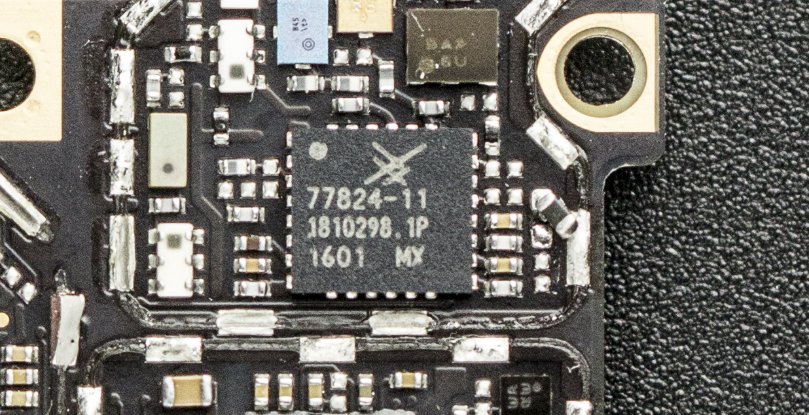
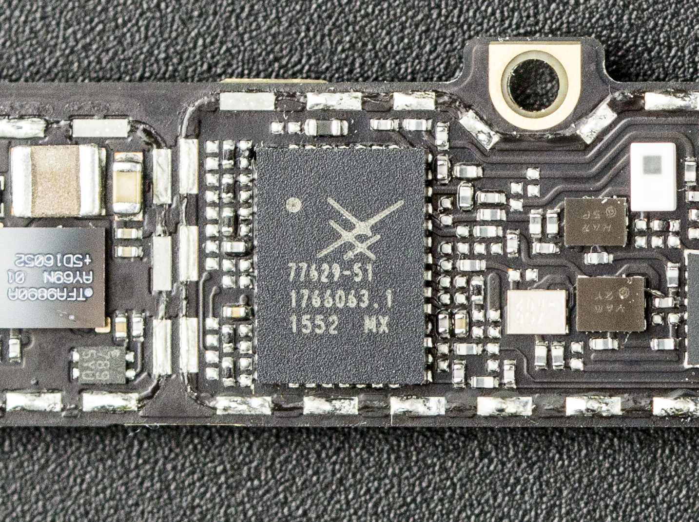
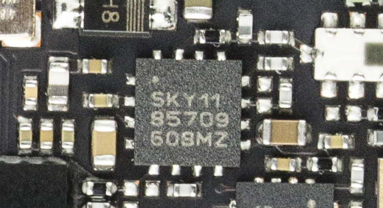
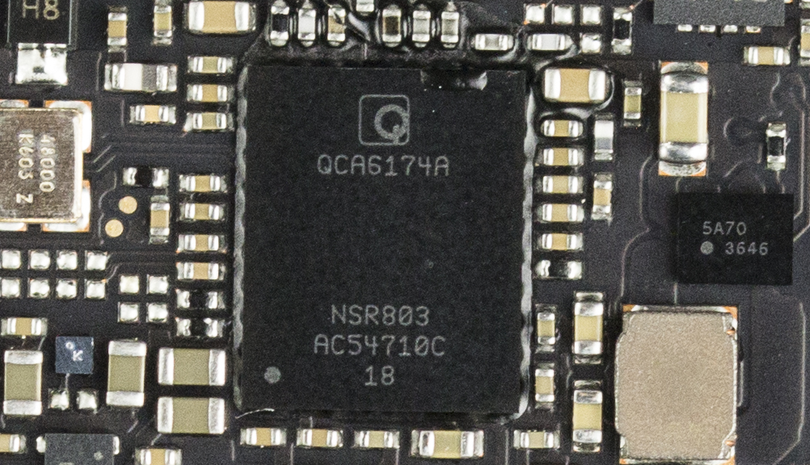

近日vivo推出了美国队长Xplay5旗舰版手机，Xplay5采用了双曲面屏+一体化金属机身的设计，是第一部国产的双曲面屏手机，旗舰版更是采用了vivo全新的HiFi 3.0系统，使用了两颗ES9028Q2M独立DAC，并搭配了3颗OPA1612独立运放，毫无疑问Xplay5旗舰版将会是现役手机中音质的最强者，来看看vivo超强音质的奥秘在哪吧。

 PS：vivo美国队长Xplay5旗舰版 的内部结构较为复杂，拆解需要专业工具，且拆解后很难还原，请普通用户不要轻易尝试。

  

在开始拆解之前先拔出SIM插槽。Xplay5旗舰版的设计可谓一脉相传，先将底部USB接口旁的梅花螺丝拆下。Xplay5旗舰版采用的是双曲面玻璃+全金属一体机身的设计，因此我们从屏幕开始拆解，使用拨片沿着屏幕和机身之间的缝隙慢慢分离。

  

双曲面玻璃先与白色垫圈黏贴在一起，再通过卡扣与金属后盖固定，拆解中要小心处理，防止卡扣断裂。

 

将后盖分解后就可以看到主板、电池等内部结构了。后盖为vivo的全金属一体成型后盖，后盖内部没有注塑NFC天线，Xplay5旗舰版可能同样没有NFC功能。

  

指纹识别模块集成在后盖上，通过触点与主板相连，这样的设计也便于后盖的拆解。

  

内部电路设计上则为比较标准的主板+电池+副版的设计。

  

先断开手机的电池排线。vivo的所有排线都是用来金属挡板+螺丝固定，可以防止排线因晃动而产生松动。

  

vivo在所有的排线上使用了金属挡板进行固定，固定相当稳固。

  

为了便于分离主板，先将扬声器副板拆下，再进行进一步拆解。

  

扬声器、USB接口和振动马达在副板之内。  

  

将所有挡板和螺丝逐一拆下后，将包括屏幕排线在内的各种排线、同轴电缆分离后，

  

电池通过双面胶黏贴在中框上，但vivo贴心为它设计了便于拆卸的拉手，先拉开标签1，再拉标签2，就可以很容易的将电池拆卸下来。

 

电池使用了与标准版相同的锂离子聚合物电池，容量为3600mAh。

  

接下来就可以拆卸主板了，除了大量螺丝外，主板边缘还使用了一圈黑色黏胶固定。

  

将主板取下，主板背部的金属屏蔽罩上覆盖用铜箔，并通过导热硅脂与中框相连，这样的设计将热量更好的传导至中框，帮助散热。相比与标准版，Xplay5旗舰版还在中框上增加了一片面积很大的散热铜片，用料相当良心，为了改善散热可谓不遗余力。

  

主板布满了金属屏蔽罩，基本上没有裸露的芯片。

 

主板背面同样布满了金属屏蔽罩，屏蔽罩上的铜箔可以增强各芯片的散热。

 

将主板拆下后我们就可以将摄像头拆卸下来了。Xplay 5的后置摄像头为1600 万像素，使用索尼IMX298传感器，镜头光圈f2.0，并没有光学防抖。前置为800万，所以两者在体积上比较接近。

  

我们将主板背面的铜箔片撕开后，就可以看到下面大面积的金属屏蔽罩，其中SoC+闪存芯片部分还是用了导热硅脂与散热铜箔。金属屏蔽罩则可以减少芯片之间的互相干扰，对手机的信号及HiFi系统的音质有一定的帮助。

  

Xplay5 旗舰版主板正面的屏蔽罩全部使用焊锡焊接在主板上，我们使用热风枪加热后将其慢慢拆下。

 

反面同样有大量的屏蔽罩，将屏蔽罩全部拆下的可以看到所有芯片的具体型号了。

  

主板背面最显眼的三星的K3RG6G60MM-MGCJ的LPDDR4内存芯片，容量为6GB，下面封装着高通MSM8996，即骁龙820，使用14nm FinFET工艺制造，配备Adreno 530 图形处理器。

  

另外一块体积比较大的是来自三星的KLUDG8J1CB-B0B1闪存芯片，芯片面积11.5×13×1.2mm，符合UFS2.0规范，容量为128GB，使用MLC G3 1Lane颗粒。

  

接下来终于到了音频芯片，该机使用了两颗ES9028Q2M独立DAC，并搭配了高达3颗的OPA1612独立运放。

  

反面另外一块面积比较大的芯片为高通PM8996电源管理IC。

  

高通 WTR3925 LTE 收发器。

  

Skyworks 77824-11 LTE功率放大模块"Power Amplifier Module For FDD LTE"。

  

Skyworks 77629 \-51 Multimode Mutiband Power Amplifier——多频多模功率放大器。

  

NXP TFA9890A high efficiency class-D audio amplifier with a sophisticated speaker boost and protection algorithm.

  

TI BQ24192 I2C Controlled 4.5A Single Cell USB/Adaptor Charger w/ Narrow VDC Power Path。

  

再来看看主板正面的芯片。Skyworks 85709-11 5GHz 802.11ac wlan front-end module——5GHz 802.11ac Wi-Fi模块。

  

高通QCA6174A wifi与蓝牙集成模块。

  

高通PMI8996 电源管理IC。

  

高通WCD9335音频解码芯片。

  

最后奉上vivo美国队长Xplay5旗舰版的拆解全家福。至此我们对美国队长vivo Xplay5旗舰版的拆解到这里就结束了，总得来说Xplay5 旗舰版延续了vivo优秀内部电路设计，主板布局相当的工整，并且在大多数芯片上都安装了屏蔽罩。在发热量最大的处理器/内存/电源管理芯片部分使用了导热硅垫+铜箔+导热硅脂+散热铜片+金属中框的方式来加强散热，用料颇为良心。

此外该机破天荒的在手机上使用了两颗ES9028Q2M独立DAC，并搭配了高达3颗OPA1612独立运放，堆料相当奢侈，在目前的移动音频领域方面可谓独一无二，称它为目前市售最强的音频手机毫不为过。
